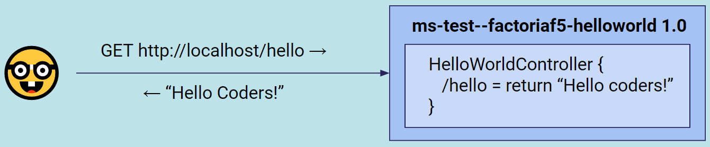
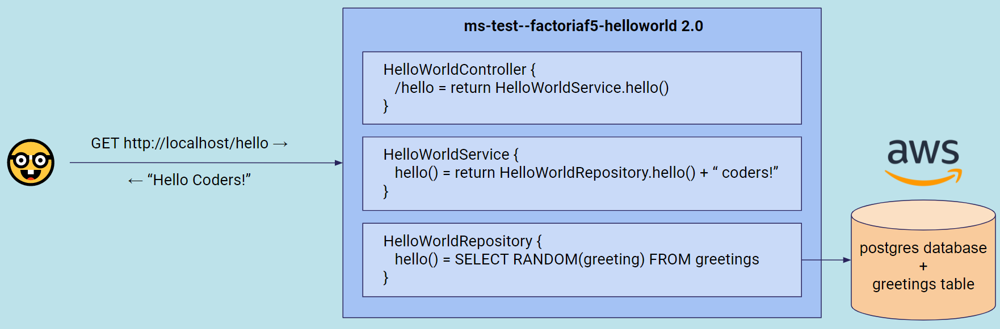

[](https://github.com/AdevintaSpain/ms-test--factoriaf5-helloworld/actions/workflows/gradle.yml)

# ms-test--factoriaf5-helloworld

🏫 HelloWorld for [Factoria F5](https://factoriaf5.org/) Bootcamp

See also [🌍 MicroServices Hello World Live from Twitch!](https://github.com/AdevintaSpain/ms-test--hello-twitch)

## Develop

### Create repo
* Clone/fork this repo or create your own using [spring initializr](https://start.spring.io/#!type=gradle-project&language=kotlin&platformVersion=2.6.3&packaging=jar&jvmVersion=11&groupId=com.adevinta.factoriaf5&artifactId=HelloWorld&name=HelloWorld&description=Demo%20project%20for%20Spring%20Boot&packageName=com.adevinta.factoriaf5.HelloWorld)
* [Setup Continuous Integration using Github Actions](https://github.com/AdevintaSpain/ms-test--factoriaf5-helloworld/pull/1/files)

### Session 1



* [Apply Adevinta Spain MicroServices Template](https://github.com/AdevintaSpain/ms-test--factoriaf5-helloworld/pull/2/files)

### Session 2



* [Create HelloWorldService](https://github.com/AdevintaSpain/ms-test--factoriaf5-helloworld/pull/4/files)
* [Create HelloWorldRepository](https://github.com/AdevintaSpain/ms-test--factoriaf5-helloworld/pull/5/files)
* [Create HelloWorldRepository JDBC implementation](https://github.com/AdevintaSpain/ms-test--factoriaf5-helloworld/pull/6/files)

## Run

```
docker-compose up -d
./gradlew bootRun

curl http://localhost/hello
```

## Test

```
./gradlew test
```

## Integration Test

```
./gradlew integrationTest
```

## Tools

* [Docker desktop](https://www.docker.com/products/docker-desktop)
* [IntelliJ Idea](https://www.jetbrains.com/idea/) or any other IDE you like
* Any [OpenJDK Java 11](https://en.wikipedia.org/wiki/OpenJDK) like [Adoptium](https://adoptium.net/)
* [DBeaver](https://dbeaver.io/download/) or any other database tool to connect to postgres
